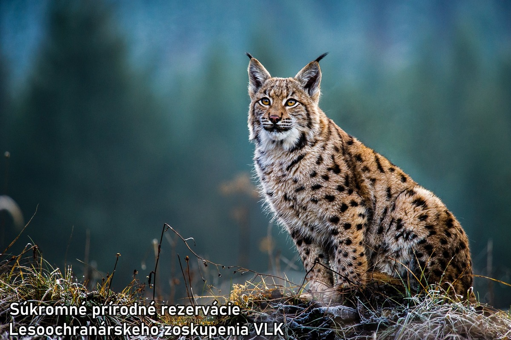
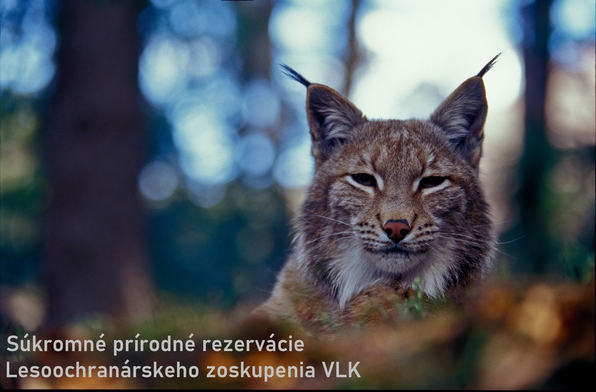

Vážení priatelia vlkov.

Už je to tu.

Zber podpisov pod **Petíciu za celoročnú ochranu vlkov** oficiálne začíname už dnes, **29. marca 2025**, na filmovom festivale **Hory a mesto** v Bratislave.

## Hory a mesto

VLK tam má dvojhodinový blok o našej práci a o vlkoch a ich ochrane. Súčasťou bloku je aj hodinová diskusia, v ktorej závere vyhlásime začatie zberu podpisov petície za obnovenie celoročnej ochrany vlkov.

## Petícia

**V prílohe** Vám posielame **text petície**, ktorý si môžete vytlačiť obojstranne a zbierať podpisy. Domnievame sa, že zozbierať 100 podpisov medzi Vašou rodinou, priateľmi a širším okolím nebude pre Vás problém. Ak sa podarí viac, isto sa potešíme, ak menej, nenahneváme sa. Zbierať podpisy plánujeme do jesene. O presnom termíne ukončenia akcie Vás budeme informovať.

Pri vypĺňaní prosím dbajte na to, aby ľudia **nepoužívali skratky** miest a obcí, ale vypísali **celý názov**.

Posielajte prosím **kompletne vyplnené hárky** (tj. s 10, resp. 20 podpismi obojstranne) na adresu uvedenú na spodku petičného hárku.

Ďakujeme v mene všetkých vlkov. Spolu to dokážeme.

Juraj Lukáč  
náčelník Lesoochranárskeho zoskupenia VLK